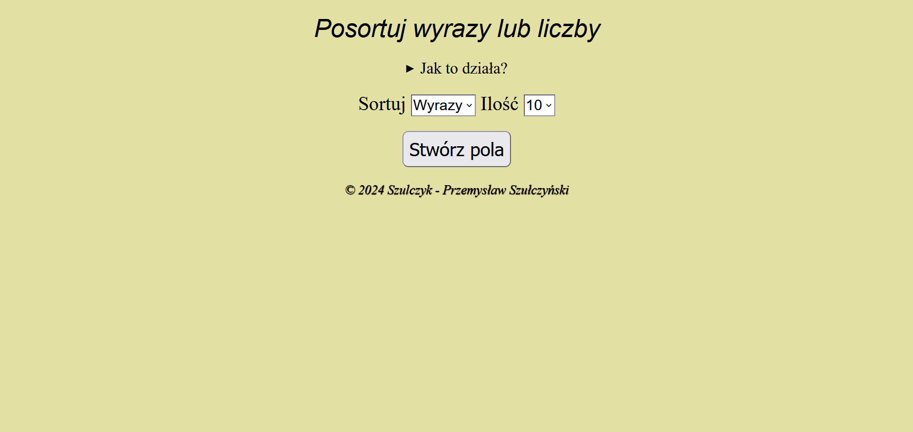
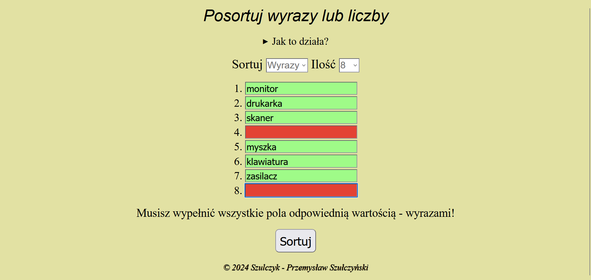
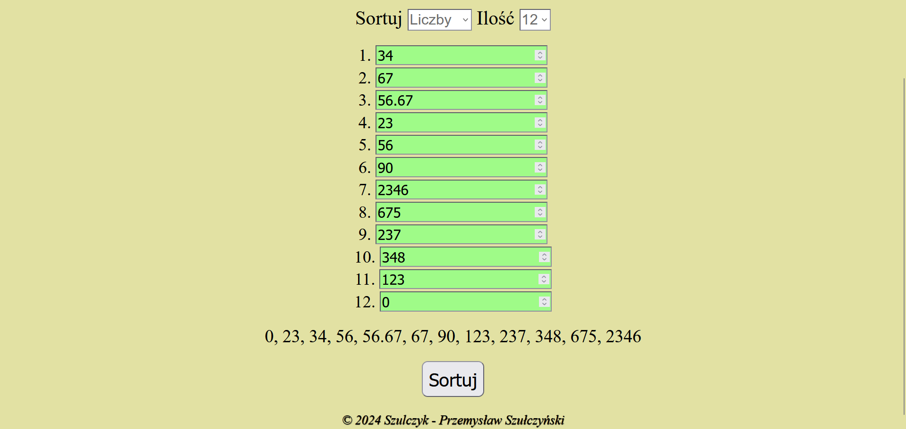
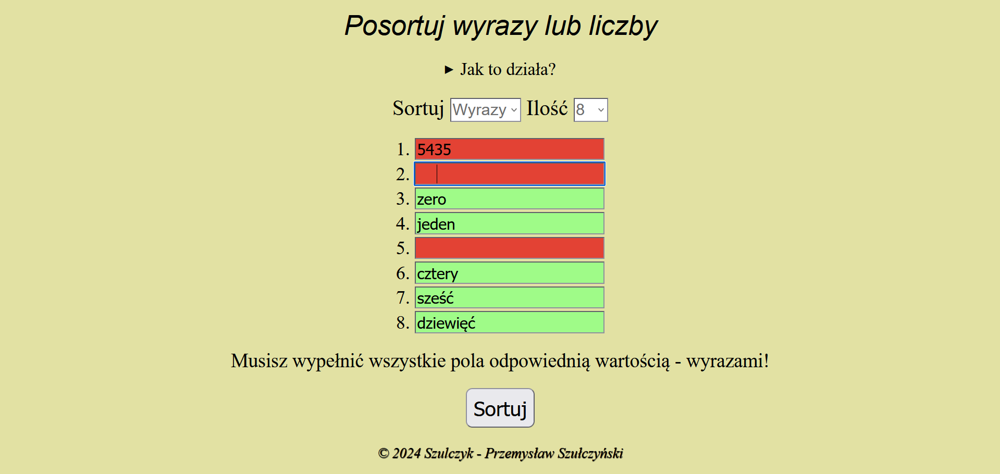

# ***[Projekt Alfabet](https://szulczyk.pl/projekt-3/alfabet)***

## 🖼️ ***Zrzuty ekranu***

 

## 📄 ***Opis projektu***
### ✅ *Projekt zakończony dnia 30.09.2024*
### *Projekt umożliwia sortowanie dowolnej liczby wyrazów lub liczb wprowadzanych bezpośrednio przez użytkownika. Główną funkcją narzędzia jest możliwość samodzielnego zdefiniowania ilości elementów, które mają zostać uporządkowane. Program wyposażono w system zabezpieczeń, który blokuje błędne dane i zapobiega błędom działania. Dla ułatwienia obsługi, do całości dołączono zwięzłą instrukcję wyjaśniającą proces sortowania.*

 

## 🛠️ ***Stack projektu***
- ### *Frontend*
  - ### *HTML5*
  - ### *CSS3*
  - ### *JavaScript*
- ### *Backend*
  - ### *Brak użytych technologii*
- ### *Bazy danych*
  - ### *Brak użytych technologii*

 

## 📌 ***Podsumowanie projektu***
### 🎯 *Projekt to funkcjonalny formularz oparty na stosie HTML, CSS i JS, który pozwala na błyskawiczne sortowanie wyrazów alfabetycznie oraz liczb w porządku rosnącym. Narzędzie zostało wyposażone w prostą instrukcję obsługi, zapewniając intuicyjność i przejrzystość działania w ramach klasycznych technologii webowych.*
### 💡 *Czego się nauczyłem:*
- ### *Pobieranie danych - przećwiczyłem, jak sprawnie wyciągać informacje z pól formularza, aby program wiedział dokładnie, co ma posortować.*
- ### *Kontrola wpisywanych treści - opanowałem sprawdzanie danych w locie, dzięki czemu mam pewność, że do algorytmu trafia dokładnie to, czego on potrzebuje.*
- ### *Praktyka CSS i RWD - przećwiczyłem tworzenie ładnego wyglądu i dopilnowałem, żeby strona prezentowała się dobrze nie tylko na komputerze, ale i na telefonie.*
- ### *Zarządzanie funkcjami - po raz pierwszy w praktyce ogarnąłem strukturę własnych funkcji, ucząc się, jak mądrze je układać i nimi sterować.*
- ### *Logika pętli for - zrozumiałem, jak za pomocą pętli automatycznie wywoływać masę operacji na raz, niezależnie od tego, ile danych wpadnie do systemu.*

 

## 📨 ***Kontakt***
- ### 📧 *E-mail -* przemo.ppk@gmail.com
- ### 💻 *Discord -* darkcoder97